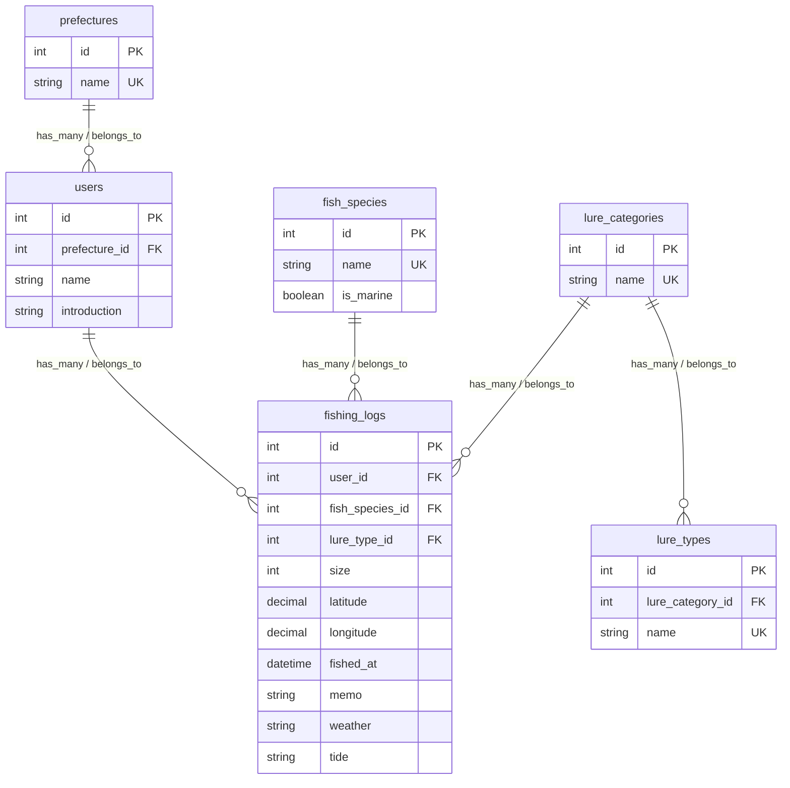

```mermaid
erDiagram

    prefectures ||--o{ users : "has_many / belongs_to"
    users ||--o{ fishing_logs : "has_many / belongs_to"
    fish_species ||--o{ fishing_logs : "has_many / belongs_to"
    lure_categories ||--o{ lure_types : "has_many / belongs_to"
    lure_categories ||--o{ fishing_logs : "has_many / belongs_to"

    prefectures {
        int id PK
        string name UK
    }

    users {
        int id PK
        int prefecture_id FK
        string name
        string introduction
    }

    fishing_logs {
        int id PK
        int user_id FK
        int fish_species_id FK
        int lure_type_id FK
        int size
        decimal latitude
        decimal longitude
        datetime fished_at
        string memo
        string weather
        string tide
    }

    fish_species {
        int id PK
        string name UK
        boolean is_marine
    }

    lure_categories {
        int id PK
        string name UK
    }

    lure_types {
        int id PK
        int lure_category_id FK
        string name UK
    }
```
