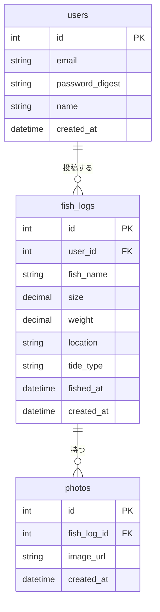

```mermaid
erDiagram
  users ||--o{ fish_logs : "投稿する"
  fish_logs ||--o{ photos : "持つ"

  users {
    int id PK
    string email
    string password_digest
    string name
    datetime created_at
  }

  fish_logs {
    int id PK
    int user_id FK
    string fish_name
    decimal size
    decimal weight
    string location
    string tide_type
    datetime fished_at
    datetime created_at
  }

  photos {
    int id PK
    int fish_log_id FK
    string image_url
    datetime created_at
  }
```