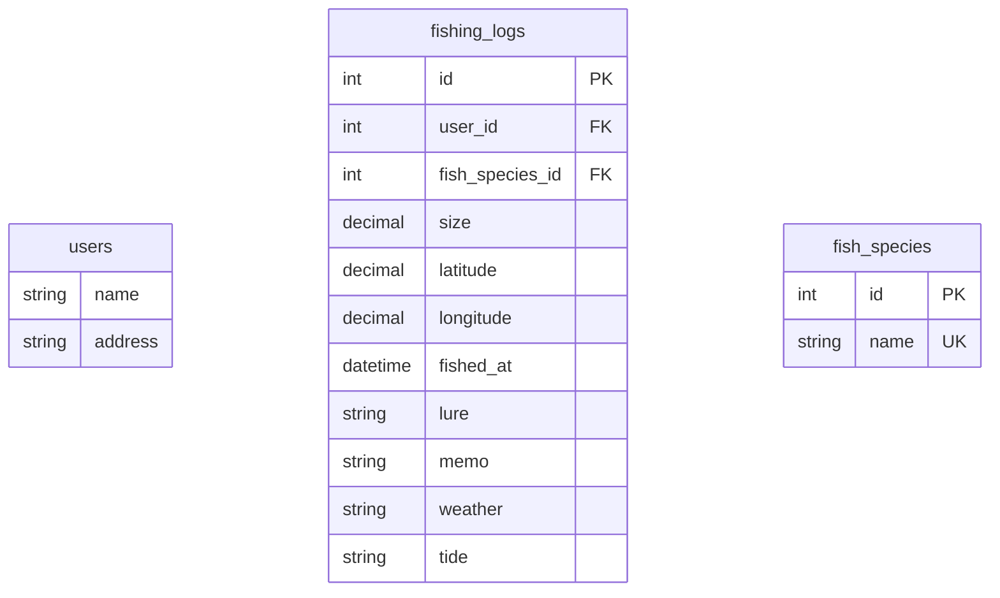

# ER図

```mermaid
erDiagram

users {
    string name
    string address
}

fishing_logs {
    int id PK
    int user_id FK
    int fish_species_id FK
    decimal size
    decimal latitude
    decimal longitude
    datetime fished_at
    string lure
    string memo
    string weather
    string tide
}

fish_species {
    int id PK
    string name UK
}

```

- 写真管理はActive Storageを使用しています
- usersテーブルについても、Deviseを使用しているため、追加カラムだけ記載しています。
