# fishing_app

## 技術選定・採用バージョン

| 技術 | 採用バージョン | 管理場所・備考 |
| --- | --- | --- |
| Ruby | 3.4.10 | `backend/Dockerfile.dev` |
| Ruby on Rails | 8.1.3.1 | `backend/Gemfile.lock` |
| PostgreSQL | 16 | `compose.yml`（メジャーバージョン指定） |
| Redis Server | 7.4.11 | `compose.yml` |
| Redis Ruby Client | 5.4.1 | `backend/Gemfile.lock` |
| Devise | 5.0.4 | `backend/Gemfile.lock` |
| devise-jwt | 0.13.0 | `backend/Gemfile.lock` |
| React + Vite | 未決定 | フロントエンド作成時に記録する |

## バージョン管理ルール

- Dockerイメージと直接指定するGemは、原則としてバージョンを固定する。
- Gemの実際の解決バージョンは`backend/Gemfile.lock`で管理し、依存関係を変更したら必ずコミットする。
- バージョンを変更したら、このREADMEとNotionの「実装計画・進捗管理」を更新し、変更理由を残す。

```mermaid
erDiagram

    prefectures ||--o{ users : "has_many / belongs_to"
    users ||--o{ fishing_logs : "has_many / belongs_to"
    fish_species ||--o{ fishing_logs : "has_many / belongs_to"
    lure_categories ||--o{ lure_types : "has_many / belongs_to"
    lure_categories ||--o{ fishing_logs : "has_many / belongs_to"
    water_types ||--o{ fishing_logs : "has_many / belongs_to"

    prefectures {
        int id PK
        string name UK
    }

    users {
        int prefecture_id FK
        string name
        string introduction
    }

    fishing_logs {
        int id PK
        int user_id FK
        int fish_species_id FK
        int lure_type_id FK
        int water_type_id FK
        int size
        decimal latitude
        decimal longitude
        datetime fished_at
        text memo
        string weather
        string tide
    }

    fish_species {
        int id PK
        string name UK
    }

    lure_categories {
        int id PK
        string name UK
    }

    lure_types {
        int id PK
        int lure_category_id FK
        string name UK
    }

    water_types {
        int id PK
        string name UK
    }
```

devise使用しているため、userテーブルにはemailを追記してません
usersテーブル、fishing_logsについては、ActiveStorageを使用しているため、カラムには追記していません
